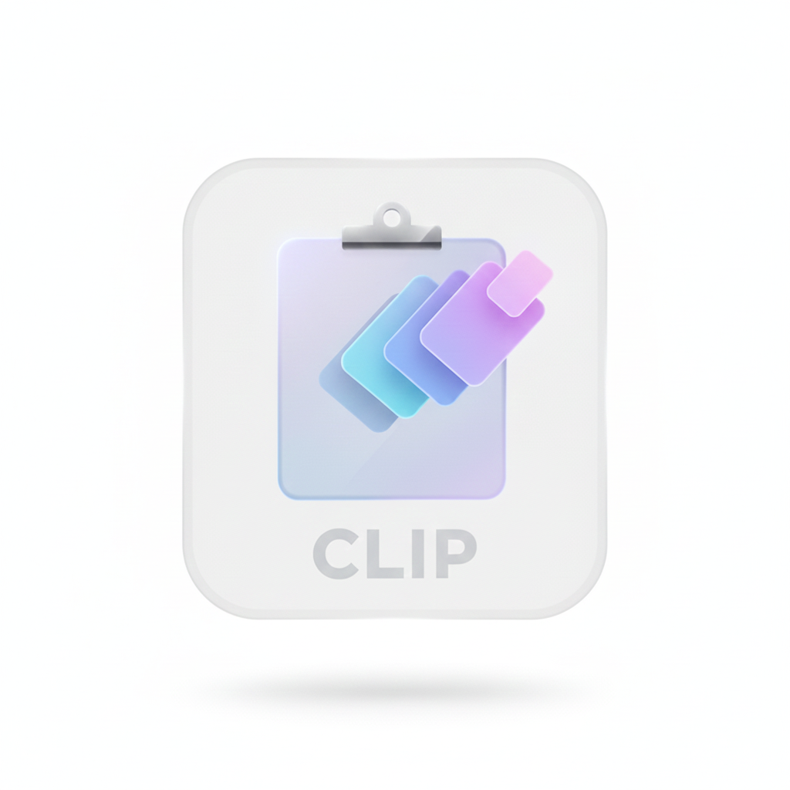
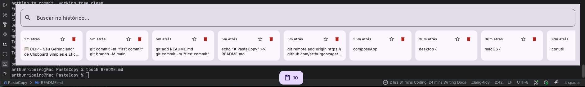

**📋 CLIP - Seu Gerenciador de Clipboard Simples e Eficaz

  

O CLIP é um gerenciador de clipboard (área de transferência) leve e intuitivo, projetado para simplificar e agilizar suas tarefas diárias de copiar e colar. Inspirado em funcionalidades simples, o CLIP armazena seu histórico de cópias, permitindo que você reutilize itens copiados anteriormente com facilidade, sem a necessidade de re-copiá-los.

✨ Funcionalidades
O CLIP foca na simplicidade e na produtividade:

Histórico de Cópias: Cada item que você copia é registrado e mantido em um histórico acessível.

Busca Rápida: Encontre rapidamente o clipe que você precisa através de uma barra de pesquisa.

Visualização Clara: Veja seus clipes recentes em um formato de grade limpo e organizado.

Reutilização Simples: Basta clicar em um item no histórico para copiá-lo de volta para a área de transferência principal.

📸 Prévia
Veja o CLIP em ação, gerenciando um histórico de comandos e textos importantes:

  

🤝 Contribuições
Contribuições são bem-vindas! Sinta-se à vontade para abrir uma issue ou enviar um pull request.